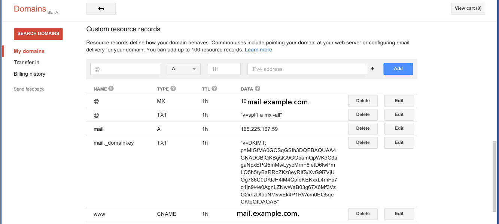

# Setup instructions 

## Obtain a docker host and source docker environment variables

### For example, on DigitalOcean:

    export DO_ACCESS_TOKEN=<API TOKEN>
    docker-machine create --driver digitalocean --digitalocean-access-token $DO_ACCESS_TOKEN mail
    eval "$(docker-machine env mail)"
    
    
## Copy the .env template and edit with your own variables 

`cp .env.template .env`
    
## Bring up your new mail server

`docker-compose -p examplecom up -d mail`
    
## Setup postfixadmin

`http://mail.example.com/postfixadmin/setup.php`
    
## Setup rainloop
    
`http://mail.example.com/?admin`

## Setup your DNS records

    
# Debug any issues
    
`docker exec -it examplecom_mail_1 bash`

# Development instructions

## Build the image

`docker build -t jgrowl/mail .`
    

# Notes

## These files/folders are important to backup and keep safe

- /etc/mail/dkim.key
- /usr/lib/courier/pop3d.pem
- /usr/lib/courier/imapd.pem
